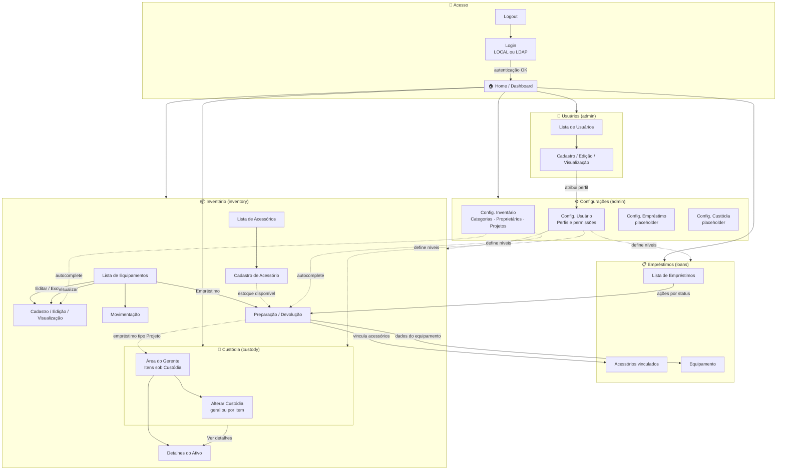
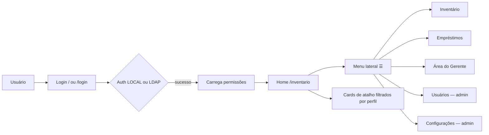
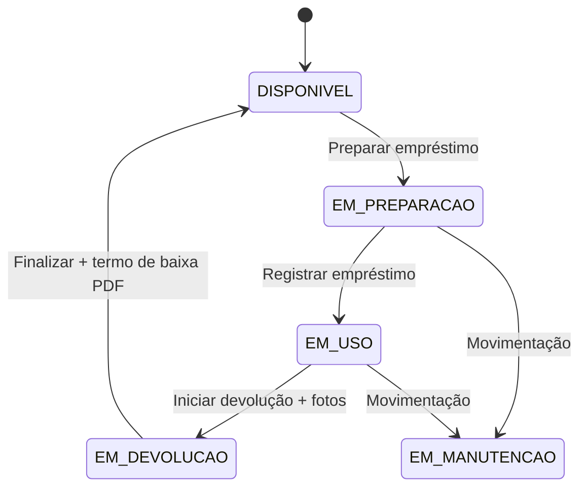
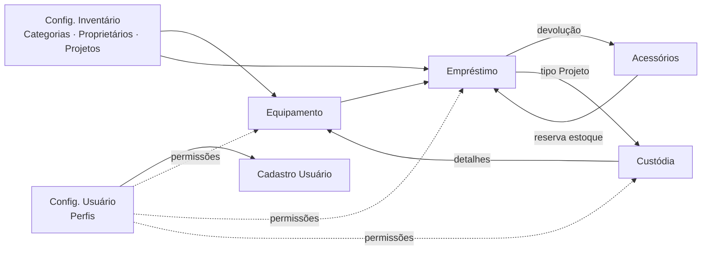

# Fluxo Completo do Sistema — Apresentação

**Sistema:** Inventory (front-end Angular)  
**Versão do documento:** Junho/2026  
**Base:** Análise do código-fonte (`app.routes.ts`, `sidebar.component.ts`, componentes e guards)

---

## 1. Visão executiva

O sistema possui **7 áreas funcionais** conectadas por autenticação, permissões e dados compartilhados (equipamentos, usuários, empréstimos e custódia):

| # | Módulo | Chave de permissão | Quem acessa |
|---|--------|-------------------|-------------|
| 0 | **Acesso** | — | Todos |
| 1 | **Home / Dashboard** | — (autenticado) | Todos |
| 2 | **Inventário** | `inventory` | Perfis com visualizar/editar |
| 3 | **Empréstimos** | `loans` | Perfis com visualizar/editar |
| 4 | **Custódia** | `custody` | Gerentes e perfis com acesso |
| 5 | **Usuários** | — | **Somente Admin** |
| 6 | **Configurações** | — | **Somente Admin** |

> **Perfis de acesso** (Inventário, Empréstimo, Custódia) são configurados em **Configuração de Usuário** e aplicados a cada usuário no cadastro.

---

## 2. Diagrama geral (todos os módulos)



---

## 3. Fluxo de entrada e navegação



**Após login:** redirecionamento para `/inventario` (dashboard com cards).  
**Menu lateral:** exibe apenas seções permitidas pelo perfil (módulo oculto = seção não aparece).  
**Logout:** toolbar → confirma → `/login`.

---

## 4. Módulo: Inventário

### 4.1 Equipamentos

| Tela | Rota | Permissão |
|------|------|-----------|
| Lista | `/equipaments` | inventory — visualizar |
| Novo | `/cadastro` | inventory — editar |
| Editar | `/cadastro/:id` | inventory — editar |
| Visualizar | `/cadastro/:id?mode=view` | inventory — visualizar |
| Movimentação | `/equipaments/:id/movimentacao` | inventory — editar |
| Detalhes do ativo | `/equipaments/:id/detalhes` | inventory **ou** custody — visualizar |

**Fluxo a partir da lista (menu ⋮):**

```
Lista de Equipamentos
  ├─ Visualizar Detalhes → Cadastro (modo view + fotos)
  ├─ Empréstimo → Preparação (se COLABORADOR + DISPONÍVEL + loans editar)
  ├─ Movimentações → Gestão de Movimentação (oculto se EM_DEVOLUCAO)
  ├─ Editar → Cadastro
  └─ Excluir → diálogo (somente DISPONÍVEL)
```

**Movimentação:** tipos ENTRADA, MANUTENCAO, DESCARTE, SAIDA — conforme status atual do equipamento. Atualiza status e registra histórico com fotos.

### 4.2 Acessórios

| Tela | Rota | Permissão |
|------|------|-----------|
| Lista | `/inventario/acessorios` | inventory — visualizar |
| Novo | `/inventario/acessorios/novo` | inventory — editar |
| Editar | `/inventario/acessorios/editar/:id` | inventory — editar |

**Visões:** disponíveis (`quantidade disponível / total`) e **itens em uso** (com responsável do empréstimo).  
**Integração:** estoque consumido na preparação do empréstimo; restituído na finalização da devolução.

---

## 5. Módulo: Empréstimos

| Tela | Rota | Permissão |
|------|------|-----------|
| Lista | `/loans` | loans — visualizar |
| Novo (via equipamento) | `/equipaments/:id/preparation-loan` | loans — editar |
| Fluxo existente | `/loans/:loanId/preparation-loan` | loans — editar |
| Legado por tombo | `/equipaments/loan-preparation` | loans — editar |

### Ciclo de vida do equipamento no empréstimo



### Ações na lista por status

| Status | Ação | Destino |
|--------|------|---------|
| DISPONÍVEL | Novo Empréstimo | preparation-loan (equipamento) |
| EM_PREPARACAO | Registrar Empréstimo | preparation-loan |
| EM_USO | Registrar Devolução | preparation-loan |
| EM_DEVOLUCAO | Finalizar Empréstimo | `?mode=return-admin` |
| EM_MANUTENCAO | — | menu desabilitado |

**Tela Preparação/Devolução:** tipo Pessoal ou Projeto, responsável, projeto (se Projeto), datas, acessórios, fotos, termo PDF, Sedex.  
**Projeto:** responsável deve ser perfil **Gerente**.

---

## 6. Módulo: Custódia (Área do Gerente)

| Tela | Rota | Permissão |
|------|------|-----------|
| Itens sob Custódia | `/area-gerente` | custody — visualizar |
| Detalhes do ativo | `/equipaments/:id/detalhes` | custody ou inventory — visualizar |

**Escopo:** listagem de equipamentos em **empréstimos tipo Projeto** sob custódia do gerente logado. Empréstimos **Pessoais** não entram na custódia.

**Fluxo:**

```
Área do Gerente
  ├─ Filtros: ID, nome, período de custódia
  ├─ Tabela: equipamento, proprietário, custodiante, início/fim
  ├─ Alterar custódia (geral ou por linha) — custody editar
  │     └─ Diálogo: selecionar equipamentos + novo custodiante + data início
  ├─ Ver detalhes → Detalhes do Ativo (histórico de custódia)
  └─ Destaque visual: custódia vencida (equipamento ainda EM_USO)
```

**Integração com Empréstimos:** empréstimo Projeto gera movimentação de custódia; alterações manuais também registram histórico.

---

## 7. Módulo: Usuários (Admin)

| Tela | Rota | Guard |
|------|------|-------|
| Lista | `/users` | admin |
| Novo | `/users/novo` | admin |
| Editar | `/users/editar/:id` | admin |
| Visualizar | `/users/visualizar/:id` | admin |

**Campos:** nome completo, e-mail, usuário, senha (obrigatória no novo), **perfil de acesso**.  
**Fluxo:** Lista → Visualizar / Editar / Excluir → Cadastro de usuário.

---

## 8. Módulo: Configurações (Admin)

### 8.1 Configuração de Inventário (`/configuracoes/inventario`)

Abas com CRUD de cadastros auxiliares usados nos formulários:

| Aba | Uso no sistema |
|-----|----------------|
| **Categorias** | Cadastro de equipamento (autocomplete) |
| **Proprietários** | Cadastro de equipamento (autocomplete) |
| **Projetos** | Empréstimo tipo Projeto + Área do Gerente |

### 8.2 Configuração de Usuário (`/configuracoes/usuario`)

- Criar / editar / excluir **perfis de acesso**
- Por perfil, definir nível por módulo: **Ocultar · Visualizar · Editar**
- Módulos: Inventário, Empréstimo, Custódia
- Perfis fixos: Admin (editar em tudo), Gerente

### 8.3 Configuração de Empréstimo e Custódia

Telas reservadas (`/configuracoes/emprestimo`, `/configuracoes/custodia`) — **conteúdo ainda não implementado** no front-end (placeholder para evolução futura).

---

## 9. Matriz de permissões

| Funcionalidade | visualizar | editar | admin |
|----------------|:----------:|:------:|:-----:|
| Home / cards | ✓ | ✓ | ✓ |
| Listas inventário | ✓* | ✓* | ✓ |
| CRUD equipamento / acessório | — | ✓* | ✓ |
| Movimentação | — | ✓* | ✓ |
| Listas empréstimos | ✓* | ✓* | ✓ |
| Fluxo empréstimo/devolução | — | ✓* | ✓ |
| Área do gerente | ✓* | — | ✓ |
| Alterar custódia | — | ✓* | ✓ |
| Detalhes do ativo | ✓* | — | ✓ |
| Usuários | — | — | ✓ |
| Configurações | — | — | ✓ |

\* Conforme módulo (`inventory`, `loans`, `custody`). Admin tem editar em todos.

---

## 10. Mapa completo de rotas

| Rota | Tela | Módulo / Guard |
|------|------|----------------|
| `/`, `/login` | Login | Público |
| `/inventario` | Home (dashboard) | Autenticado |
| `/equipaments` | Lista de Equipamentos | inventory |
| `/cadastro` | Novo Equipamento | inventory editar |
| `/cadastro/:id` | Editar Equipamento | equipmentFormGuard |
| `/equipaments/:id/movimentacao` | Movimentação | inventory editar |
| `/equipaments/:id/detalhes` | Detalhes do Ativo | inventory ou custody |
| `/movimentacao/visualizar/:movementId` | Ver movimentação | inventory visualizar |
| `/inventario/acessorios` | Lista de Acessórios | inventory |
| `/inventario/acessorios/novo` | Novo Acessório | inventory editar |
| `/inventario/acessorios/editar/:id` | Editar Acessório | inventory editar |
| `/loans` | Lista de Empréstimos | loans |
| `/equipaments/:id/preparation-loan` | Preparação (novo) | loans editar |
| `/loans/:loanId/preparation-loan` | Empréstimo / Devolução | loans editar |
| `/equipaments/loan-preparation` | Empréstimo por tombo (legado) | loans editar |
| `/area-gerente` | Área do Gerente | custody |
| `/users` | Lista de Usuários | admin |
| `/users/novo` | Novo Usuário | admin |
| `/users/editar/:id` | Editar Usuário | admin |
| `/users/visualizar/:id` | Visualizar Usuário | admin |
| `/configuracoes/inventario` | Config. Inventário | admin |
| `/configuracoes/usuario` | Config. Usuário (perfis) | admin |
| `/configuracoes/emprestimo` | Config. Empréstimo | admin |
| `/configuracoes/custodia` | Config. Custódia | admin |

---

## 11. Integrações entre módulos (resumo)



---

## 12. Prompt para gerar a imagem (ChatGPT / IA de imagem)

Copie o bloco abaixo e peça à IA para gerar um diagrama no **mesmo estilo** da imagem de referência (fundo escuro, caixas coloridas por módulo, setas direcionais, ícones simples):

---

**PROMPT:**

Crie um diagrama de fluxo de sistema para apresentação corporativa, estilo infográfico moderno, fundo escuro (dark theme), caixas com bordas arredondadas e cores distintas por módulo, setas claras entre os blocos, texto em português brasileiro, layout horizontal/vertical organizado em seções grandes.

O sistema se chama **Inventory** e possui estes módulos principais (da esquerda para direita ou de cima para baixo):

**1. ACESSO (cinza/azul claro)**  
- Login (LOCAL ou LDAP) → seta para Home/Dashboard  
- Logout volta ao Login

**2. HOME / DASHBOARD (azul neutro)**  
- Tela inicial com cards de atalho para todos os módulos permitidos ao usuário  
- Menu lateral com: Inventário, Empréstimos, Área do Gerente, Usuários (admin), Configurações (admin)

**3. INVENTÁRIO (azul)** — permissão "inventory"  
Três fluxos paralelos dentro da seção:  
- **Equipamentos:** Lista de Equipamentos → ações: Editar/Excluir, Visualizar, Movimentações, Empréstimo → Cadastro de Equipamento  
- **Movimentações:** tipos Entrada, Manutenção, Descarte, Saída  
- **Acessórios:** Lista de Acessórios ↔ Novo/Editar Acessório (estoque disponível/total)

**4. EMPRÉSTIMOS (azul/verde)** — permissão "loans"  
- Lista de Empréstimos → Ações por status → Preparação / Devolução  
- Caixa lateral "Equipamento" (Código, Proprietário, Tipo de Uso, Características)  
- Caixa lateral "Acessórios" (lista vinculada ao empréstimo)  
- Botão "Vincula" conectando acessórios ao empréstimo  
- Ciclo de status: Disponível → Em preparação → Em uso → Em devolução → Disponível

**5. CUSTÓDIA / ÁREA DO GERENTE (dourado/amarelo)** — permissão "custody"  
- Itens sob Custódia (empréstimos tipo Projeto)  
- Alterar Custódia (geral ou por item)  
- Ver Detalhes do Ativo (histórico de custódia)  
- Seta de Empréstimos (tipo Projeto) para Custódia

**6. USUÁRIOS (verde)** — somente Admin  
- Lista de Usuários → Novo / Editar / Visualizar Usuário  
- Cada usuário recebe um Perfil de Acesso

**7. CONFIGURAÇÕES (roxo/cinza)** — somente Admin  
- Config. Inventário: Categorias, Proprietários, Projetos (alimentam cadastros)  
- Config. Usuário: Perfis com permissões Ocultar/Visualizar/Editar por módulo  
- Config. Empréstimo e Config. Custódia (áreas reservadas)

**CONEXÕES ENTRE MÓDULOS (setas tracejadas ou etiquetas):**  
- Inventário "Empréstimo" → Empréstimos  
- Acessórios "Estoque disponível" → Empréstimos "Vincula"  
- Config. Inventário → Cadastro de Equipamento e Empréstimo  
- Config. Usuário → controla visibilidade de Inventário, Empréstimos e Custódia  
- Empréstimo Projeto → Área do Gerente (Custódia)  
- Custódia → Detalhes do Ativo (equipamento)

Estilo visual: similar a diagrama de arquitetura de software para slide de apresentação, legível em projeção, sem texto ilegível pequeno demais.

---

## 13. Como usar este documento na apresentação

1. **Mermaid:** cole os diagramas da seção 2 ou 11 em [mermaid.live](https://mermaid.live) e exporte PNG/SVG.  
2. **Imagem estilizada:** use o prompt da seção 12 no ChatGPT (modo imagem) ou outra IA, anexando a imagem atual como referência de estilo.  
3. **Demonstração ao vivo:** siga o roteiro do documento `fluxo-apresentacao-inventario.md` para Inventário + Empréstimos; acrescente 5 min para Custódia e 3 min para Admin (usuários + config. inventário/perfis).

---

*Documento gerado a partir da análise do repositório `inventory` — front-end Angular.*
